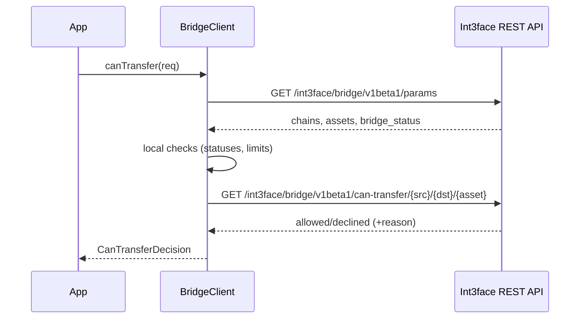
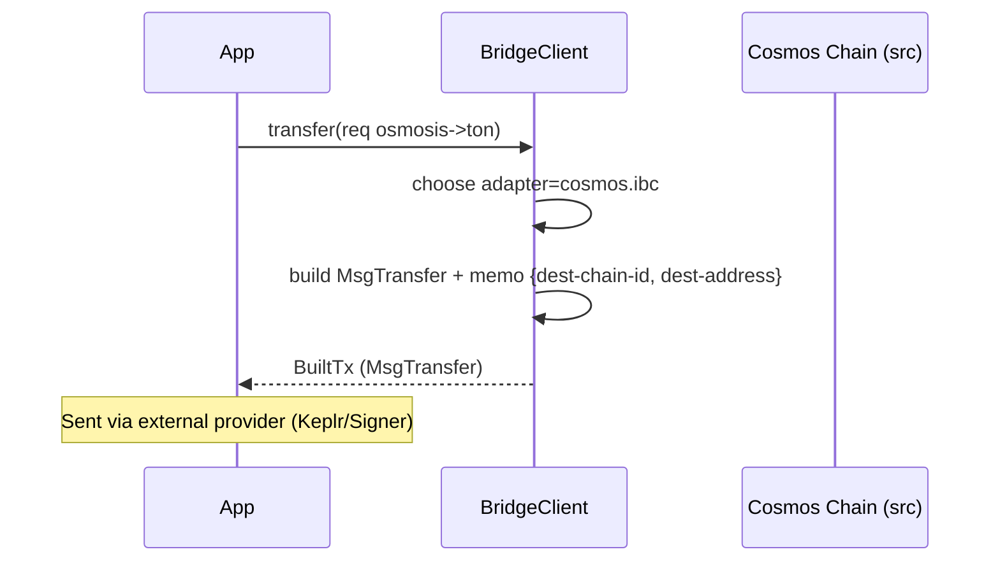
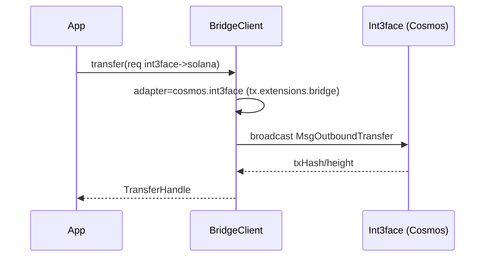
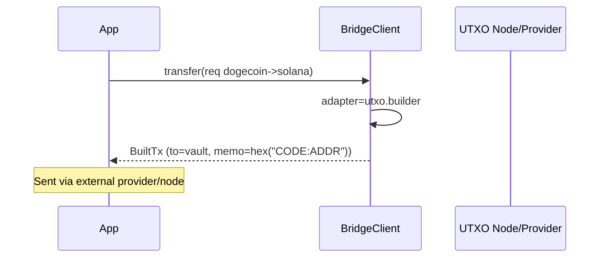
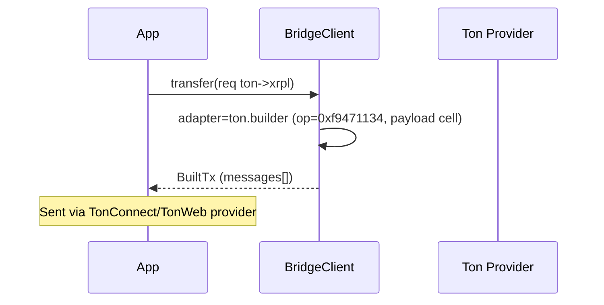
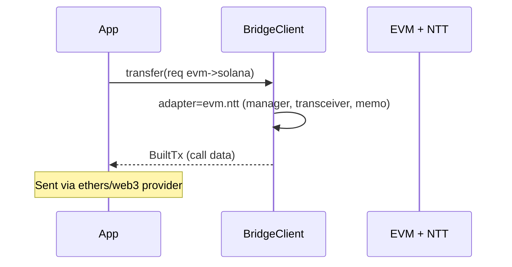

# BitFrost TypeScript SDK — Architecture and Design (Draft)

## 1. SDK scope

The SDK operates at the `chain_id` and `asset_id` levels:
- `chain_id` — unique chain identifier (e.g., `osmosis`, `ton`, `xrpl`, `dogecoin`).
- `asset_id` — unique asset identifier: `source_chain + "-" + denom` (e.g., `bitcoin-btc`).

Primary scenarios:
1) Discovery and transfer validation:
   - periodically fetch parameters from the Int3face API (`/int3face/bridge/v1beta1/params`): chains, assets, bridge_status;
   - local preflight (statuses, limits, availability of chains/assets);
   - online check via `CanTransfer`.
2) Transfer initiation by source chain type:
   - Cosmos IBC, Int3face MsgOutboundTransfer;
   - UTXO (Bitcoin family) — send to the vault with memo encoded in hex;
   - Payment (XRPL) — Payment with memo (type/data hex);
   - TON — transfer to the contract with payload (cell) in `CODE:address` format;
   - Solana — transfer to the bridge contract (details below);
   - EVM (via Wormhole NTT) — NTT transfer with memo.
3) Tracking statuses (inbound/outbound), obtaining receipts and, where applicable, follow‑up actions (claim/refund).

Out of scope: implementing external network wallets. The SDK exposes “build‑only” and “provider‑assisted” modes via adapters and provider interfaces.

---

## 2. Design principles
- Single high‑level entry point (BridgeClient) on top of existing clients.
- Clear separation: Core (validation/orchestration), Adapters (chain‑specific), Providers (wallet/transport), Types/Errors.
- Extensibility: add new chains via the adapter interface without changing the Core.
- Minimal dependencies: reuse existing `BitfrostQueryClient`, `BitfrostTxClient`, `Wallet` (Cosmos).
- Security and DX: strict types, explicit error statuses, predictable side effects.
- Observability: events and logging via an interface, without hard‑binding to a specific library.

---

## 3. Key components

### 3.1 High‑level client: BridgeClient
The orchestrator for “discover → preflight → execute → track” flows. Built on:
- `BitfrostQueryClient` — read state, Params, CanTransfer, transfer statuses;
- `BitfrostTxClient` — build and send transactions to Int3face/Cosmos;
- Chain Adapters — build and/or send transactions to external networks;
- Registry/Cache — cache of supported chains/assets and statuses.

Public API (sketch):
- `init(config: BridgeConfig): Promise<void>` — initialization and initial sync.
- `refresh(): Promise<void>` — force updating the chains/assets/bridge_status cache.
- `getRegistry(): Promise<RegistrySnapshot>` — current catalog of chains/assets.
- `canTransfer(req: TransferRequest): Promise<CanTransferDecision>` — combines local checks + RPC CanTransfer.
- `transfer(req: TransferRequest, options?: TransferOptions): Promise<TransferHandle>` — starts a transfer via the appropriate adapter.
- `track(ref: TransferRef): AsyncGenerator<TransferEvent>` — status event stream.
- `estimate(req: TransferRequest): Promise<Estimate>` — fee/limit estimation (when data is available).
- `on(event, cb)` — subscribe to events (logic, progress, warnings).

### 3.2 Configuration: BridgeConfig
- `network: 'mainnet' | 'testnet'`;
- `restEndpoint: string` (for Params/CanTransfer); optional `headers?: { 'x-api-key'?: string }`;
- `rpcEndpoint: string` (Cosmos RPC for Query/Tx);
- `pollIntervalMs?: number` (default 30000);
- `adapters?: Partial<AdaptersMap>` — external adapters/providers;
- `logger?: Logger` — logging interface;
- `cosmos?: { signer?: OfflineSigner; fee?: FeeLike; }`;
- `timeouts?: { canTransfer?: number; execute?: number; }`.

### 3.3 Types (abridged)
- `TransferRequest` { fromChainId, toChainId, assetId, amount: string, toAddress };
- `TransferOptions` { memoOverride?, fee?, dryRun? };
- `TransferRef` { txId?: string; fromChainId; };
- `TransferHandle` { txId, submitTxHash?, fromChainId, toChainId, assetId };
- `CanTransferDecision` { allowed: boolean; reason?: string; details?: any };
- `Estimate` { fees?: Record<string,string>; minAmount?: string };
- `RegistrySnapshot` { chains, assets, bridgeStatus }.

Types should reference generated protobufs where applicable (e.g., `AssetID` from `/generated/int3face/bridge/v1beta1/...`).

### 3.4 Errors
- `BridgeBlockedError` (bridge_status ≠ OK)
- `AssetBlockedError | UnsupportedAssetError`
- `AmountTooLowError`
- `ChainUnavailableError`
- `ChainAssetDirectionBlockedError`
- `CanTransferDeclinedError`
- `ProviderError` (external provider/wallet related errors)

All errors include codes/metadata for debugging.

### 3.5 Observability and events
- `Logger` interface with levels: debug/info/warn/error.
- Events: `onPreflight`, `onCanTransfer`, `onSubmitted`, `onConfirmed`, `onFailed`.

---

## 4. Registry and synchronization (Params polling)
- Periodically (every 30s by default, configurable) call `GET /int3face/bridge/v1beta1/params` on the selected `restEndpoint`.
- Cache:
  - `chains` (including type‑specific fields: `chain_wallet`, `vault_address`, `contract_address`, `assets`, `code_id`),
  - `assets`,
  - `bridge_status`.
- Local checks in `canTransfer()`:
  1) `bridge_status` = OK;
  2) global `asset_status` = OK;
  3) `amount` ≥ `asset.min_transfer_amount` (if specified);
  4) `src_chain`, `dst_chain` ∈ supported;
  5) `src_chain.status`, `dst_chain.status` = OK;
  6) `asset` exists on both chains;
  7) asset status on chains: OK, or special modes:
     - allow if source has `BLOCKED_OUTBOUND` (inbound‑only is allowed);
     - allow if destination has `BLOCKED_INBOUND` (outbound‑only is allowed).
- Online check: `CanTransfer(src, dst, asset_id)` via `/int3face/bridge/v1beta1/can-transfer/{src}/{dst}/{asset}`.

---

## 5. Chain Adapters
Unified adapter interface:

```ts
interface ChainAdapter {
  readonly kind: 'cosmos'|'utxo'|'payment'|'ton'|'solana'|'evm';
  canHandle(fromChainId: string): boolean;
  build(req: TransferRequest, ctx: BuildContext): Promise<BuiltTx>; // build only, no send
  send?(built: BuiltTx, provider: unknown): Promise<TransferHandle>; // optional, if a provider is available
}
```

Where `BuildContext` includes the registry snapshot, network, code_id mapping, the asset exponent, etc. `BuiltTx` is a structure suitable for the target network (e.g., IBC MsgTransfer, XRPL Payment params, TON payload, UTXO tx params).

The SDK provides default “build‑only” adapters for all types, and “provider‑assisted” implementations for Cosmos/Int3face (via `BitfrostTxClient`). Custom providers can be injected via `BridgeConfig.adapters`.

### 5.1 Cosmos‑SDK (IBC and Int3face)
- If `fromChainId === 'int3face'`: use `MsgOutboundTransfer` via `tx.extensions.bridge.makeOutboundTransfer()` — already implemented in the SDK.
- Otherwise (any Cosmos chain): build `MsgTransfer` (IBC) with a JSON memo of the form:
  `{ "dest-chain-id": "<code_id>", "dest-address": "<addr>" }`.
- The IBC `receiver` address: `chain.chain.chain_wallet` from the registry.
- Denom: `chain.chain.assets[asset_id].external_ibc_denom`.

### 5.2 UTXO (BTC/LTC/DOGE/BCH)
- Destination address: `chain.chain.vault_address`.
- Memo: a string `<DEST_CODE_ID>:<DEST_ADDRESS>`, hex‑encoded.
- Transaction building — build‑only (UTXO inputs/fees are out of scope for the SDK). Sending — via a provider (e.g., Ctrl/xDeFi API) if available.

### 5.3 Payment (XRPL)
- Destination address: `chain.chain.vault_address`.
- Memo: `memoType = hex('Transfer')`, `memoData = hex('<DEST_CODE_ID>:<DEST_ADDRESS>')`.
- Amount in drops according to the asset `exponent` (from registry.assets).
- Sending: through an external XRPL provider (wallet/sdk), or return parameters for forming a `Payment`.

### 5.4 TON
- Destination address: `chain.chain.contract_address`.
- Payload: BOC cell with operation code `0xf9471134` and string `<DEST_CODE_ID>:<DEST_ADDRESS>`.
- Sending: via a TonConnect/TonWeb provider, or return `messages[]` for the UI.

### 5.5 Solana
- Destination address: `solana-bridge-contract` from the registry (as soon as it is provided in params).
- Memo/data: as required by the program (confirm with the program contract). In the SDK: build‑only based on Program ID + layout; provider — `@solana/web3.js`.

### 5.6 EVM (via Wormhole NTT)
- Sending: via an EVM provider (ethers/web3) and the Wormhole NTT SDK.
- Memo/parameters: according to the NTT spec and configuration for the specific asset/chain.
- Within this draft — contract interface and build‑only description; sending — via a pluggable provider.

---

## 6. Public API (type sketches and examples)

```ts
// Initialization
const query = await BitfrostQueryClient.connect(rpcEndpoint);
const tx = cosmosSigner ? await BitfrostTxClient.connectWithSigner(rpcEndpoint, cosmosSigner) : undefined;

const bridge = await BridgeClient.init({
  network: 'mainnet',
  restEndpoint: 'https://api.mainnet.int3face.zone',
  rpcEndpoint,
  pollIntervalMs: 30000,
  cosmos: { signer: cosmosSigner },
  headers: { 'x-api-key': process.env.INT3_API_KEY },
});

// Preflight
const req: TransferRequest = {
  fromChainId: 'osmosis',
  toChainId: 'ton',
  assetId: 'bitcoin-btc',
  amount: '100000',
  toAddress: 'EQ....',
};
const decision = await bridge.canTransfer(req);
if (!decision.allowed) throw new Error(decision.reason);

// Execute (Cosmos IBC example)
const handle = await bridge.transfer(req);
console.log('submitted', handle.txId);

// Track
for await (const evt of bridge.track({ txId: handle.txId, fromChainId: req.fromChainId })) {
  console.log(evt);
}
```

---

## 7. Implementation on top of the existing code

We reuse:
- `BitfrostQueryClient` + `setupBitfrostQueryExtensions` — access to `Params`, `CanTransfer`, `GetChains/Assets`, `Outbound/InboundTransfer`, etc.
- `BitfrostTxClient` + `BridgeTxExtension` — `MsgOutboundTransfer`.
- `Wallet` — Cosmos wallet generation/import and signer.

Thin wrappers (the “orchestrator” layer):
- `BridgeClient` (a new class) — organizes the sync loop, cache, and high‑level operations.
- `Adapters` — a set of chain‑specific builders.
- `Providers` (optional) — integrations with external network wallets (interfaces + thin adapters, shipped separately or via DI).

This ensures minimal code changes: the main logic is concentrated in a new Orchestrator module without touching existing clients.

---

## 8. Configuration, API key, and security
- Support `x-api-key` in `BridgeConfig.headers` for requests to the Int3face public API (optional for now).
- Keep keys outside of the SDK (application/secret store). The SDK only forwards the header.
- Validate input parameters at the public API boundary.

---

## 9. Observability and logging
- `Logger` interface (default — no‑op). Users can plug in any logger.
- Transfer lifecycle events for UI/telemetry.

---

## 10. Versioning and compatibility
- SemVer. Minor versions — new adapters/features without breaking the API.
- Beta functionality is explicitly marked (Solana/EVM NTT sending — as contracts/SDKs are ready).

---

## 11. Concurrency and flows
- Polling runs in a single timer; re‑starting is idempotent.
- Thread‑safe cache (in the browser — one instance per app, in Node — its own scope).

---

## 12. Requirements compliance map
- Periodic Params fetch: yes (configurable, 30s by default).
- Full set of local status/limit checks: yes.
- Preliminary online `CanTransfer` check: yes.
- Memo/tx formats by chain: reflected in adapters (Cosmos JSON memo, UTXO hex memo, XRPL memos, TON cell, Solana/EVM NTT — build‑only with clarifications).
- Extensibility to any Cosmos‑SDK chain: yes (IBC build).

---

## 13. Next steps (Roadmap)
1) Implement `BridgeClient` (core) and basic adapter classes (build‑only) + unit tests.
2) Support sending for TON (TonConnect) and XRPL (xrpl.js) via optional providers.
3) Solana adapter (web3.js, confirm program format) — build + send.
4) EVM Wormhole NTT adapter — integrate with the official SDK.
5) Observability: basic events + timing metrics.
6) Public API documentation and examples.

---

Appendix: transaction/memo formats
- Cosmos IBC: `{ "dest-chain-id": "<code>", "dest-address": "<addr>" }`;
- UTXO: `"<CODE>:<ADDRESS>"` in hex;
- XRPL: `memoType = hex('Transfer')`, `memoData = hex('<CODE>:<ADDRESS>')`;
- TON: a cell with op=0xf9471134 and string `<CODE>:<ADDRESS>`; address — `contract_address`.


---

## 14. SDK directory structure (proposal)

A proposed structure for evolving the SDK while keeping backward compatibility with the current modules.

```
src/
  index.ts
  sdk/
    query/
      client.ts
      extensions/
        bridge.ts
        fees.ts
        epochs.ts
        incentives.ts
        quarantine.ts
        ratelimit.ts
        tokenfactory.ts
    tx/
      client.ts
      extensions/
        bridge.ts
    wallet/
      wallet.ts                      // Cosmos Wallet (mnemonic -> OfflineSigner)
    bridge/                          // New "orchestrator" (high-level layer)
      bridgeClient.ts                // BridgeClient: discover → preflight → execute → track
      registry.ts                    // Cache for chains/assets/bridge_status + synchronization
      types.ts                       // TransferRequest/Handle/Events/Estimate/Errors
      errors.ts
      config.ts                      // BridgeConfig and schemas for external endpoints
    adapters/                        // Transaction building for external networks
      cosmos/
        ibc.ts                       // MsgTransfer memo builder
        int3face.ts                  // Wrappers around MsgOutboundTransfer (reuse BitfrostTxClient)
      utxo/
        builder.ts                   // build-only: vault addresses + memo hex
      xrpl/
        builder.ts                   // build-only: Payment + Memos
      ton/
        builder.ts                   // build-only: messages + payload cell
      solana/
        builder.ts                   // build-only: instructions for the bridge program
      evm/
        ntt.ts                       // build-only: NTT parameters
    providers/                       // (Optional) interfaces for sending external txs
      utxo/...
      xrpl/...
      ton/...
      solana/...
      evm/...
    utils/
      http.ts                        // fetch with headers/x-api-key, retries
      codecs.ts                      // hex/base64/memo codecs
    types/
      index.ts
```

- All adapters/providers are a thin layer around the “BuildContext”, not required in the first version as full “send” providers (build-only is enough).
- Adding a new network = a new adapter without Core changes.

---

## 15. Core flow diagrams

### 15.1 Preflight + CanTransfer


### 15.2 Cosmos IBC → Memo


### 15.3 Int3face → MsgOutboundTransfer


### 15.4 UTXO → Vault + hex memo


### 15.5 TON → Contract payload


### 15.6 EVM (Wormhole NTT)


---

## 16. External chain configuration and custom endpoints

Extend `BridgeConfig` with an `external` block to configure RPC/nodes and adapter parameters. All fields are optional; if not specified — values from the registry (params) and/or library defaults are used.

```ts
export interface BridgeConfig {
  network: 'mainnet' | 'testnet';
  restEndpoint: string;                 // Int3face REST (params, can-transfer, fees)
  rpcEndpoint: string;                  // Int3face Tendermint RPC (Cosmos query/tx)
  headers?: { 'x-api-key'?: string };   // For Int3face REST
  pollIntervalMs?: number;
  logger?: Logger;
  cosmos?: { signer?: OfflineSigner; fee?: FeeLike; };
  timeouts?: { canTransfer?: number; execute?: number; };

  external?: {
    cosmos?: {
      rpcByChainId?: Record<string, string>;     // RPC for external Cosmos chains
      restByChainId?: Record<string, string>;    // REST (if needed)
      bech32ByChainId?: Record<string, string>;  // Prefixes
    };
    utxo?: {
      rpcByChainId?: Record<string, string>;     // Bitcoin/Litecoin/Dogecoin/BCH endpoints
      feeRateByChainId?: Record<string, string>; // Optional overhead for building
    };
    xrpl?: {
      serverUrlByChainId?: Record<string, string>; // wss/http for xrpl.js
    };
    ton?: {
      endpointByChainId?: Record<string, string>;  // https API (toncenter, etc.)
    };
    solana?: {
      rpcByChainId?: Record<string, string>;       // https RPC for @solana/web3.js
      wsByChainId?: Record<string, string>;        // optional WS
    };
    evm?: {
      rpcByChainId?: Record<string, string>;       // JSON-RPC
      ntt?: {
        managerAddressByChainId?: Record<string, string>;
        transceiverIndex?: number;                 // defaults to 0
      };
    };
  };
}
```

- These endpoints are used by the corresponding adapters/providers to build/send transactions.
- Users can specify custom RPCs for testnets/private nodes.

---

## 17. Wallets and private keys

The SDK must be suitable for both frontend and server. The wallet layer is built on provider interfaces. A Cosmos wallet is already available as `Wallet` (mnemonic → OfflineSigner).

### 17.1 Cosmos (Int3face and IBC)
- FE: Keplr/Leap/WalletConnect → provides an `OfflineSigner`.
- Server: `DirectSecp256k1HdWallet` (as in `src/sdk/wallet/wallet.ts`) or a KMS (wrapped in an OfflineSigner‑compatible interface).

### 17.2 Common interface for external providers
```ts
export interface ExternalWalletProvider<TBuilt, THandle = string> {
  getAddress(): Promise<string>;
  // Preferably sign+send; otherwise only send() if the SDK builds the tx
  signAndSend(tx: TBuilt): Promise<THandle>;
}
```

Specializations:
- UTXO: a provider that accepts parameters for building/signing/sending (PSBT/network context).
- XRPL: xrpl.js provider (`wallet`, `client`) or Xumm.
- TON: TonConnect/TonWeb provider (send(messages)).
- Solana: `@solana/web3.js` Keypair/Wallet Adapter (sendTransaction).
- EVM: Ethers/Web3 `Signer`.

### 17.3 Modes of use
- Build‑only: the SDK returns a `BuiltTx`, the application signs/sends via a provider.
- Provider‑assisted: for Cosmos/Int3face — the SDK can send immediately (via `BitfrostTxClient`) if an `OfflineSigner` is present.

### 17.4 Security
- Keep private keys outside the SDK (browser extensions/server secret stores/KMS/HSM).
- Never log keys/seeds; support redaction in `Logger`.
- On the server — restrict access by roles, use .env/secret manager.

---

## 18. Fee estimation

Support a separate call to estimate the bridge fee for an asset/route via a public endpoint.

Endpoint: `POST {restEndpoint}/int3face/fees/estimation`

Request Body:
```json
{
  "src_chain_id": "dogecoin",
  "dst_chain_id": "solana",
  "asset_id": {
    "source_chain": "dogecoin",
    "denom": "doge"
  }
}
```

Response (protobuf):
```protobuf
message MsgQueryFeeEstimationResponse {
  required string fee_rate = 1; // Fee rate for the bridge route/asset
}
```

API integration:
```ts
// Returns Estimate, including the fee from the REST endpoint
async function estimate(req: TransferRequest): Promise<Estimate> {
  const body = {
    src_chain_id: req.fromChainId,
    dst_chain_id: req.toChainId,
    asset_id: parseAssetId(req.assetId),
  };
  const r = await http.post(`${restEndpoint}/int3face/fees/estimation`, body, { headers });
  return { fees: { bridge_fee_rate: r.fee_rate } };
}
```
